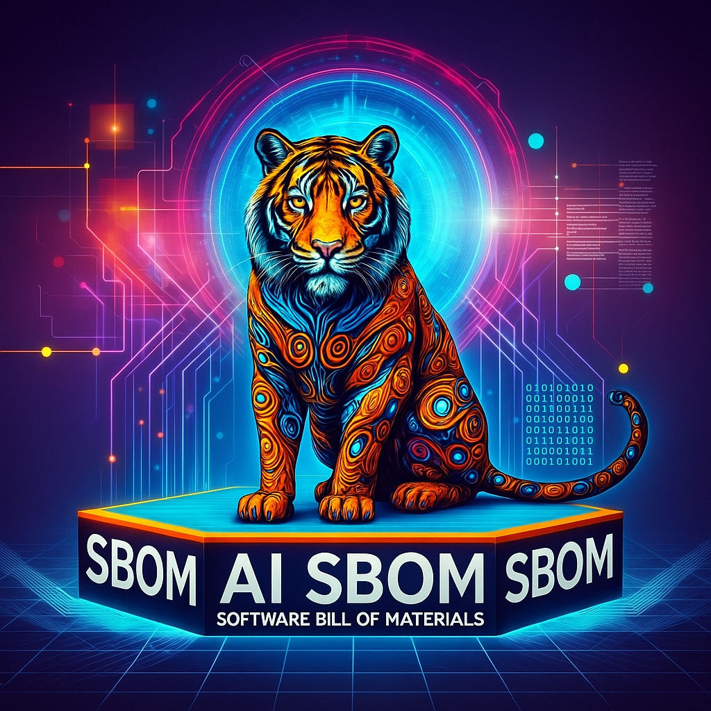

# Welcome to SBOM for AI Tiger Team

Table of Contents
- [Key Activities](#key-activities)
- [Guiding Principles for SBOM for AI Tiger Team](#guiding-principles-for-sbom-for-ai-tiger-team)
- [Additional Resources](#additional-resources)
- [Participation](#participation)
- [How to Get Involved](#how-to-get-involved)
- [Key Contacts](#key-contacts)

---

## Key Activities
- Publishing SBOM for AI Use Cases paper: see final draft [here](../README.md)] and CISA.gov reference (link - tbd).
- Mapping SBOM for AI fields to defined use cases [[Google drive folder with working docs](https://drive.google.com/drive/folders/16y1wcQtwe_6LFosxmRTt5FHjtT2xlgek?usp=sharing)]
- Creating examples of SBOMs for AI (e.g., [here](SBOM-Examples/))
- Developing further white papers and/or documentation to support industry adoption.

Out of scope: SBOM for AI tool creation

Each in-person workshop (such as at RSAC or SBOM-a-Rama) has a dedicated [repository](https://github.com/orgs/aibom-squad/repositories) with specific agendas, presentations, and updates.

---

## Guiding Principles for SBOM for AI Tiger Team
- **Outcome-driven:** Focus on achieving tangible results.
- **Define and stick to scope:** Maintain clear boundaries for our work.
- **Work is done outside of meetings:** Use meeting time for collaboration, not for individual work.
- **No sales or marketing:** Keep discussions and contributions non-commercial.
- **Expect change and need to adapt:** Stay flexible to new developments.
- **Not advising USG:** This team does not set government policy.

---

### Additional Resources
- SBOM for AU Use Cases are published [here]()
- Examples SBOMs for AI are [here](SBOM-Examples/)
- SBOM for AI standardized formats: [CycloneDX](https://cyclonedx.org/capabilities/mlbom/) and [SPDX](https://spdx.dev/learn/areas-of-interest/ai/)
- SBOM for AI generation tools: find some open-source tools on [CycloneDX Tool Center](https://cyclonedx.org/tool-center/)

---

## Participation
The SBOM for AI Tiger Team is a community-driven effort, including experts from various organizations contributing diverse perspectives and expertise.  
We encourage collaboration and welcome new members who are passionate about AI security, transparency, and supply chain integrity.

---

### How to Get Involved
Your one-stop source for all key links and meeting details is the [Google Doc](https://docs.google.com/document/d/1IpXG7XBOJnPl_hwFf3JZkDaFb0k2CnI0/edit?usp=sharing&ouid=110194678381965933391&rtpof=true&sd=true).
- **Attend Bi-Weekly Calls:** Mondays at 2 PM ET via Zoom (details in the Google Doc).
  - Ongoing meeting minutes are maintained in this [Google Doc](https://docs.google.com/document/d/1IpXG7XBOJnPl_hwFf3JZkDaFb0k2CnI0/edit?usp=sharing&ouid=110194678381965933391&rtpof=true&sd=true)
- **Stay Updated:** Read the ongoing meeting minutes.
- **Contribute and Review:** Actively engage in reviewing and contributing to working documents.
- **Join Slack:** Participate in our Slack discussions: bomworkingcommunity.slack.com

---

## Key Contacts
For more information, reach out to the SBOM for AI Tiger Team co-leads:
- [Helen Oakley](https://www.linkedin.com/in/helen-oakley/)
- [Daniel Bardenstein](https://www.linkedin.com/in/bardenstein/)
- [Dmitry Raidman](https://www.linkedin.com/in/draidman/)

